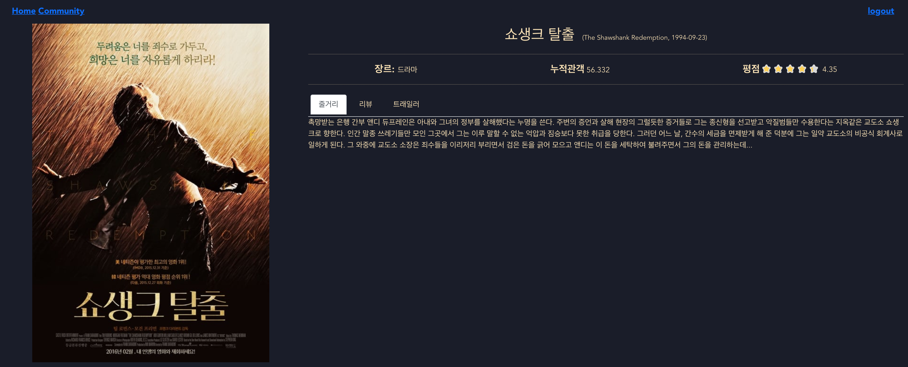
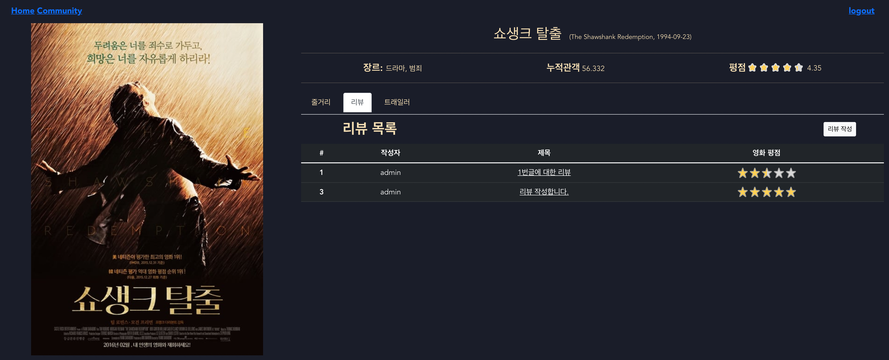
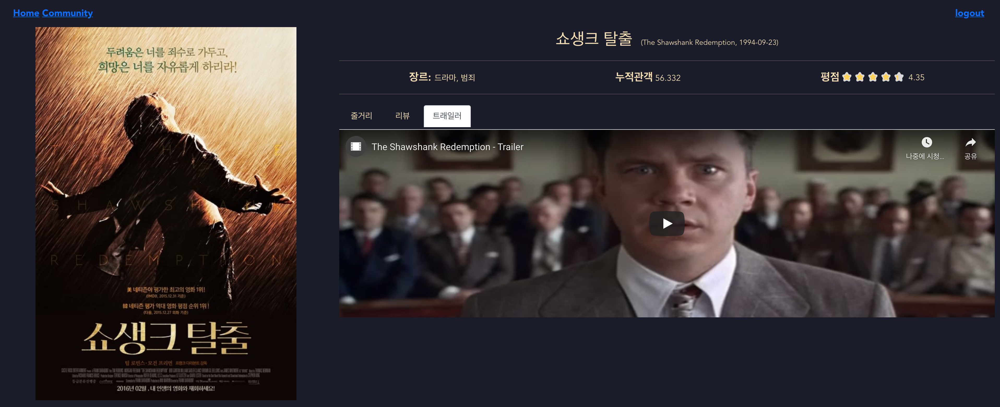
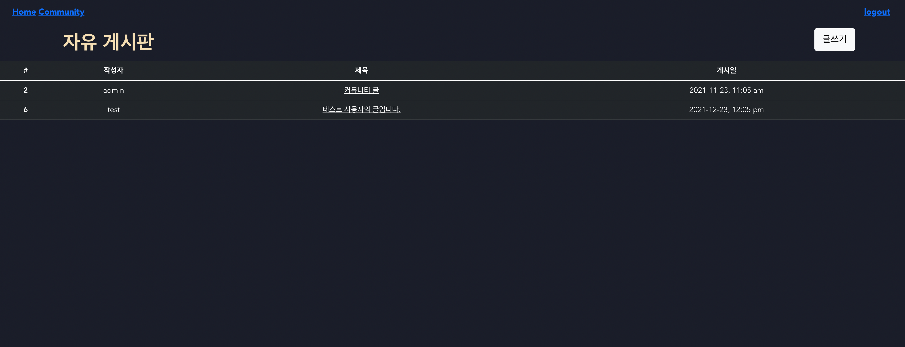
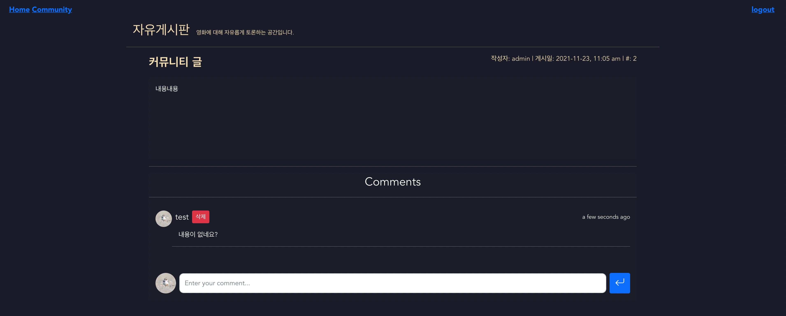

# 영화다(多)


## 시작하기

```bash
# 더미데이터 세팅
$ python manage.py makemigrations
$ python manage.py migrate

# tmdb 기반 영화 데이터 추가
python manage.py loaddata movies/fixtures/tmdb.json
```


## 팀원 정보 및 업무 분담 내역

| 팀원   | 업무 내용                                                    |
| ------ | ------------------------------------------------------------ |
| 류완수 | Backend(DB, API 설계), Frontend 개발 보조(디자인, 컨셉, API 연결) |
| 조정제 | Frontend(레이아웃 및 디테일 디자인), Backend 개발 보조(API 연결) |


## 기술 스택

Front:  Vue.js(vuex)

Back: Django


## 목표 서비스 구현 및 실제 구현 정도

#### accounts

- [x] 회원가입 및 로그인
- [ ] 영화, 리뷰, 게시글에 대한 좋아요 및 회원 팔로잉
- [ ] 프로필 페이지 + 사진

#### movies

- [x] 영화 정보 및 상세 정보 조회
- [x] 영화에 대한 리뷰 작성 + 평점
- [x] 리뷰에 대한 댓글
- [x] 트래일러 연동 기능
- [x] 영화 추천 기능 + 캐러셀 기능
- [ ] 좋아요 기능
- [ ] 검색창을 통해 영화 검색

#### community

- [x] 게시글 리스트 조회 및 상세 정보 조회
- [x] 게시글 작성
- [x] 게시글에 대한 댓글
- [ ] 게시판 검색 기능


## 서비스 기능 및 구현

## accounts

1. Sign up
   - Client 에서 valid 한 양식으로 회원가입 데이터를 전송할 시 데이터베이스에 해당 회원 정보를 저장
   - 양식이 valid 하지 않다면 error 발생 (HTTP 400)
2. Sign in
   - Django Rest Framework JSON Web Tokens 사용하여 로그인 기능 구현 (`djangorestframework-jwt`)
   - 로그인 시 Client 의 local storage 에 JWT 를 저장하고, 토큰값과 로그인 여부 및 usrname 을 `vuex state` 에 저장
   - 서버에 로그인이 필요한 서비스를 요청할 때마다 `state` 에 저장한 회원 정보를 이용

## Movies

1. 영화 데이터 수집 및 DB 반영

   - TMDB API 를 활용하여 받아온 영화 데이터를 json 파일로 저장한 후, 해당 데이터를 `loaddata` 해주어 데이터베이스에 입력

2. Home 페이지 내 전체 영화 정보 출력

   - client 가 Home 페이지 (front base url) 접속 시, 서버에 저장된 영화 정보들을 AJAX 요청을 통해 받아온다.
   - 서버로부터 전송받은 영화 데이터를 `vuex state` 에 저장
   - `MovieCard` 컴포넌트를 통해 영화들을 리스팅

   

3. 영화 상세 정보 출력

   - 서비스 로그인 시 이용 가능
   - 영화에 대한 간략한 정보 (title 과 포스터) 를 보여주는 `MovieCard` 컴포넌트 클릭 시 해당 영화에 대한 상세 정보를 보여주는 MovieDetail 페이지로 이동
   - 장르, 평점, 흥행도, 줄거리를 포함한 영화에 대한 상세 정보와 해당 영화에 대한 회원들의 리뷰, 트래일러 영상 조회 가능

   

   

   

   

4. 영화 리뷰 작성

   - 서비스 로그인 시 이용 가능
   - 영화 상세 정보 페이지 내 리뷰 탭에서 해당 영화에 대한 리뷰를 작성할 수 있다.
   - 리뷰 작성 시 리뷰 제목 및 내용 그리고 해당 영화의 평점 작성 가능
   - 리뷰에 대한 댓글 작성 가능

   

5. 영화 추천

   - 서비스 로그인 시 이용 가능
   - Home 페이지 상 영화 추천 버튼을 눌러 영화를 추천받을 수 있다.
   - 최신 영화 추천의 경우, 데이터베이스 상에서 개봉일이 가장 최신인 영화 12 편을 추천
   - 평점을 통한 추천의 경우, 데이터베이스 상에서 평점이 가장 높은 영화 12 편을 추천
   - 날씨에 따른 영화 추천
     - 기상청 Open API 를 이용하여 날씨 데이터를 받아온 후, 날씨에 어울리는 영화를 추천
       - 맑음: 범죄 영화 추천
       - 구름 조금: 스릴러 영화 추천
       - 구름 많이: 공포 영화 추천
       - 흐림: 로맨스 영화 추천
     - 해당 장르 영화 중 평점이 가장 높은 영화 12개를 추천

   

   


## Community

1. 전체 게시글 리스트

   - Home 에서 router-link 를 통해 커뮤니티 페이지로 접속하면 커뮤니티에 작성된 전체 게시글을 조회할 수 있다.
   - 게시글 리스트의 경우, 로그인하지 않아도 조회 가능

   

2. 게시글 상세 조회

   - 서비스 로그인 시 이용 가능
   - 로그인 후 게시글 리스트에서 제목을 클릭하면 게시글의 내용을 조회할 수 있다.
   - 게시글에 대한 댓글 작성 가능

3. 게시글 작성

   - 서비스 로그인 시 커뮤니티에 글을 작성할 수 있다.

   