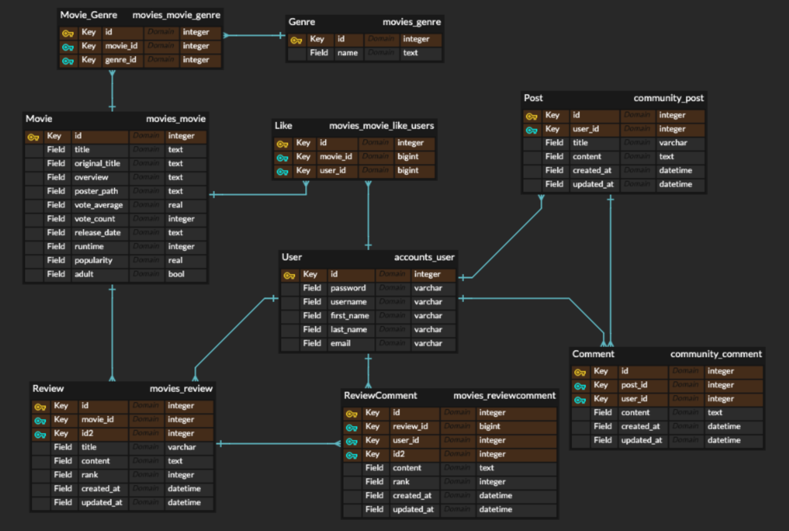

# Final Project

## 0. 프로젝트 개요

## 주제

 영화 데이터를 기반으로 영화들을 추천해주고, 관련 리뷰나 글을 작성할 수 있는 커뮤니티 사이트 개발

## 개발 환경 및 기술 스택

- python 3.9+
- Django 3.X
- Node 14.X
- Vue.js 2.+

## Architecture

- Back-end: Django REST API
- Front-end: Vue.js(vuex)

# 1. 팀원 정보 및 업무 분담 내역

- 류완수 (팀장): Back-end 개발 전반 담당 및 Front-end 개발 보조
- 조정제: Front-end 개발 전반 담당 및 Back-end 개발 보조

# 2. 목표 서비스 구현 및 실제 구현

## accounts 

- 회원가입 및 로그인 기능 구현
- 영화, 리뷰, 게시글에 대한 좋아요 및 회원 팔로잉 기능 구현 (미반영)
- 프로필 페이지 구현 (미반영)

## Movies 

- 영화 정보 리스팅 및 상세 정보 조회 기능 구현
- 영화에 대한 리뷰 작성 및 리뷰에 대한 댓글 기능 구현
- 영화 검색 기능 구현 (미반영)

## Community

- 게시글 리스트 조회 및 상세 조회 기능 구현
- 게시글 작성 및 댓글 작성 기능 구현

# 3. 데이터베이스 모델링 (ERD)

# 4. 서비스 기능 및 구현

## accounts

1. Sign up
   - Client 에서 valid 한 양식으로 회원가입 데이터를 전송할 시 데이터베이스에 해당 회원 정보를 저장
   - 양식이 valid 하지 않다면 error  발생 (HTTP 400)
2. Sign in
   - Django Rest Framework JSON Web Tokens 사용하여 로그인 기능 구현 (`djangorestframework-jwt`)
   - 로그인 시 Client 의 local storage 에 JWT 를 저장하고, 토큰값과 로그인 여부 및 usrname 을 `vuex state` 에 저장
   - 서버에 로그인이 필요한 서비스를 요청할 때마다 `state` 에 저장한 회원 정보를 이용

## Movies

1. 영화 데이터 수집 및 DB 반영
   - TMDB API 를 활용하여 받아온 영화 데이터를 json 파일로 저장한 후, 해당 데이터를 `loaddata` 해주어 데이터베이스에 입력
2. Home 페이지 내 전체 영화 정보 출력
   - client 가 Home 페이지 (front base url) 접속 시, 서버에 저장된 영화 정보들을 AJAX 요청을 통해 받아온다.
   - 서버로부터 전송받은 영화 데이터를 `vuex state` 에 저장
   - `MovieCard` 컴포넌트를 통해 영화들을 리스팅
3. 영화 상세 정보 출력
   - 서비스 로그인 시 이용 가능
   - 영화에 대한 간략한 정보 (title 과 포스터) 를 보여주는 `MovieCard` 컴포넌트 클릭 시 해당 영화에 대한 상세 정보를 보여주는 MovieDetail 페이지로 이동
   - 장르, 평점, 흥행도, 줄거리를 포함한 영화에 대한 상세 정보와 해당 영화에 대한 회원들의 리뷰, 트래일러 영상 조회 가능
4. 영화 리뷰 
   - 서비스 로그인 시 이용 가능
   - 영화 상세 정보 페이지 내 리뷰 탭에서 해당 영화에 대한 리뷰를 작성할 수 있다. 
   - 리뷰 작성 시 리뷰 제목 및 내용 그리고 해당 영화의 평점 작성 가능
   - 리뷰에 대한 댓글 작성 가능
5. 영화 추천
   - 서비스 로그인 시 이용 가능
   - Home 페이지 상 영화 추천 버튼을 눌러 영화를 추천받을 수 있다. 
   - 최신 영화 추천의 경우, 데이터베이스 상에서 개봉일이 가장 최신인 영화 12 편을 추천
   - 평점을 통한 추천의 경우, 데이터베이스 상에서 평점이 가장 높은 영화 12 편을 추천
   - 날씨에 따른 영화 추천
     - 기상청 Open API 를 이용하여 날씨 데이터를 받아온 후, 날씨에 어울리는 영화를 추천
       - 맑음: 범죄 영화 추천
       - 구름 조금: 스릴러 영화 추천
       - 구름 많이: 공포 영화 추천
       - 흐림: 로맨스 영화 추천
     - 해당 장르 영화 중 평점이 가장 높은 영화 12개를 추천

## Community

1. 전체 게시글 리스트
   - Home 에서 router-link 를 통해 커뮤니티 페이지로 접속하면 커뮤니티에 작성된 전체 게시글을 조회할 수 있다.
   - 게시글 리스트의 경우, 로그인하지 않아도 조회 가능
2. 게시글 상세 조회
   - 서비스 로그인 시 이용 가능
   - 로그인 후 게시글 리스트에서 제목을 클릭하면 게시글의 내용을 조회할 수 있다. 
   - 게시글에 대한 댓글 작성 가능
3. 게시글 작성
   - 서비스 로그인 시 커뮤니티에 글을 작성할 수 있다. 

# 5. 배포 관련 정보

배포하지 않았습니다. 

# 6. 느낀 점

 이번 프로젝트에서 전반적으로 각 기능의 동작 자체에 목적을 둔 개발을 진행했던 것 같아 가장 크게 아쉬움이 남는 것 같습니다. 아무래도 기간이 한정되어 있다보니, 발생한 문제의 근본적인 원인 + 그와 관련된 기반 지식들을 명확하게 파악, 습득하여 문제를 해결하기보다는 기능을 동작하게 하는 다른 방식을 찾는 식으로 개발을 진행해나갔던 것 같습니다. 아직 웹, 프레임워크 관련 지식이 부족해 명확한 문제 원인 파악, 더 좋은 코드로 리펙토링 해나가는 것 자체가 쉬운 일이 아니긴 했지만 냉정하게 바라보면 조금은 주먹구구식으로 프로젝트를 진행했다고 평가할 수 있을 것 같습니다. 

- 브라우저 콘솔 창에서는 에러가 출력되나 기능적으로는 정상적으로 동작하는 경우, 왜 이러한 에러가 발생하여 메시지들이 출력되었는지 파악 및 해결하지 못했습니다. 
- 라이프 사이클 훅 상에서 state 맵핑이 정상적으로 작동하지 않는 경우가 있었는데, 이 문제도 원인 파악을 하지 못하고, 단순히 파라미터 패싱을 통해 해결을 했던 점이 아쉬웠습니다. 
- 프론트 엔드 스타일링 시에 너무 부트스트랩에 의존했던 점도 큰 아쉬움으로 남습니다. 
